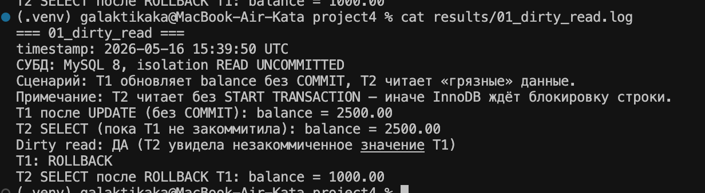
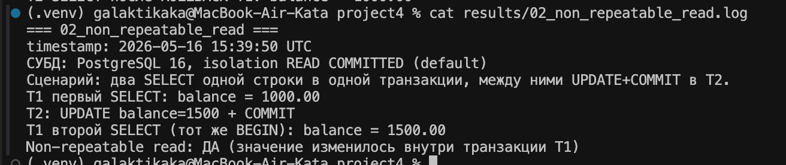
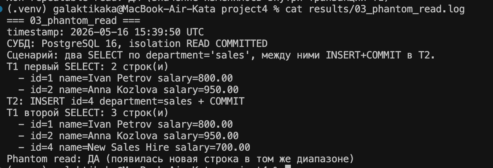
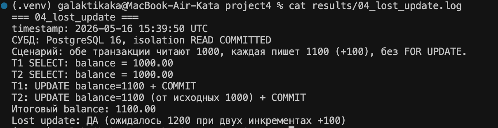
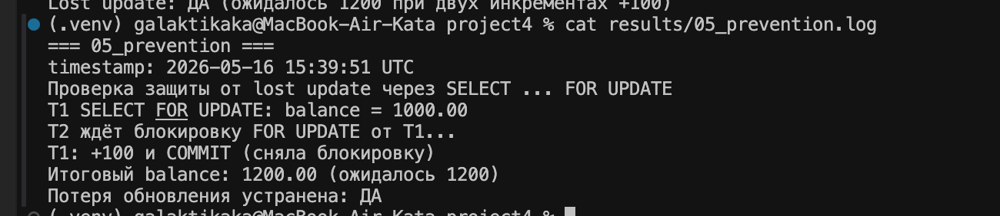

# Отчёт: аномалии изоляции в SQL

## 1. Цель и стенд

**Цель:** показать на практике, что при параллельной работе с БД возникают **аномалии изоляции**, и описать способы их предотвращения.

**Воспроизведённые аномалии:**

| № | Аномалия | СУБД | Уровень изоляции |
|---|----------|------|------------------|
| 1 | Dirty read | MySQL 8.4 | `READ UNCOMMITTED` |
| 2 | Non-repeatable read | PostgreSQL 16 | `READ COMMITTED` |
| 3 | Phantom read | PostgreSQL 16 | `READ COMMITTED` |
| 4 | Lost update | PostgreSQL 16 | `READ COMMITTED` |

**Стенд:**

```
Docker Compose
├── PostgreSQL 16  → localhost:5434  (isolation_demo)
└── MySQL 8.4      → localhost:3307  (isolation_demo)
```

- Таблицы: `accounts`, `employees` — `docker/init.sql`, `docker/init-mysql.sql`.
- Автопрогон: `./run.sh` → `scripts/run_demos.py`.
- Логи: `results/*.log`.

> **Почему MySQL для dirty read?** В PostgreSQL уровень `READ UNCOMMITTED` работает как `READ COMMITTED`, грязное чтение там не воспроизводится. Для dirty read используется MySQL; остальные три сценария — PostgreSQL.

---

## 2. Dirty read (грязное чтение)

### Суть

Транзакция **T2** читает строку, которую **T1** изменила, но ещё **не закоммитила**. Если T1 сделает `ROLLBACK`, T2 опиралась на данные, которых в БД «не было».

### Таблица и данные

```sql
-- MySQL (docker/init-mysql.sql)
CREATE TABLE accounts (
    id INT PRIMARY KEY,
    owner_name VARCHAR(100) NOT NULL,
    balance DECIMAL(12, 2) NOT NULL
);
INSERT INTO accounts VALUES (1, 'Alice', 1000.00);
```

### Шаги воспроизведения

| Шаг | T1 | T2 |
|-----|----|----|
| 1 | `SET SESSION TRANSACTION ISOLATION LEVEL READ UNCOMMITTED;` | то же |
| 2 | `UPDATE accounts SET balance = 2500 WHERE id = 1;` (без `COMMIT`) | |
| 3 | | `SELECT balance ...` **без** `START TRANSACTION` |
| 4 | | видит **2500** — грязное чтение |
| 5 | `ROLLBACK;` | |
| 6 | | `SELECT balance ...` → **1000** |

> В InnoDB `SELECT` внутри `START TRANSACTION` при незакоммиченном `UPDATE` в T1 ждёт блокировку (lock wait). Поэтому T2 читает с `autocommit` и без явной транзакции.

### Результат

**Лог:** `results/01_dirty_read.log`

| Шаг | Результат |
|-----|-----------|
| T1 после `UPDATE` (без `COMMIT`) | balance = **2500.00** |
| T2 `SELECT` до commit T1 | balance = **2500.00** |
| Вывод | **Dirty read: ДА** |
| T1 `ROLLBACK`, T2 снова `SELECT` | balance = **1000.00** |



### Как избежать

- Не использовать `READ UNCOMMITTED` в продакшене.
- Уровень **`READ COMMITTED`** или выше.
- В PostgreSQL dirty read недоступен на любом уровне изоляции.

---

## 3. Non-repeatable read (неповторяющееся чтение)

### Суть

В одной транзакции **T1** дважды читает одну и ту же строку. **T2** между чтениями меняет её и делает `COMMIT`. Второй `SELECT` в T1 возвращает **другое** значение.

### Таблица и данные

```sql
-- PostgreSQL: accounts id=1, Alice, balance=1000.00
```

### Шаги воспроизведения

| Шаг | T1 (`READ COMMITTED`) | T2 |
|-----|----------------------|-----|
| 1 | `BEGIN;` | |
| 2 | `SELECT balance WHERE id=1` → **1000** | |
| 3 | | `BEGIN; UPDATE ... SET 1500; COMMIT;` |
| 4 | `SELECT balance WHERE id=1` → **1500** | |
| 5 | `COMMIT;` | |

### Результат

**Лог:** `results/02_non_repeatable_read.log`

| Чтение | balance |
|--------|---------|
| T1, первый `SELECT` | **1000.00** |
| T1, второй `SELECT` (тот же `BEGIN`) | **1500.00** |
| Вывод | **Non-repeatable read: ДА** |



### Как избежать

- Уровень **`REPEATABLE READ`** или **`SERIALIZABLE`** — снимок фиксируется на всю транзакцию.
- При необходимости: `SELECT ... FOR SHARE` / `FOR UPDATE`.

---

## 4. Phantom read (фантомное чтение)

### Суть

**T1** дважды выполняет один запрос с условием (`WHERE department = 'sales'`). **T2** между запросами **вставляет** новую подходящую строку и коммитит. Второй запрос в T1 возвращает **больше строк**.

### Таблица и данные

```sql
-- employees: 2 строки department='sales', 1 строка department='it'
```

### Шаги воспроизведения

| Шаг | T1 (`READ COMMITTED`) | T2 |
|-----|----------------------|-----|
| 1 | `BEGIN;` | |
| 2 | `SELECT ... WHERE department='sales'` → **2 строки** | |
| 3 | | `INSERT ... 'New Sales Hire', 'sales', 700; COMMIT;` |
| 4 | `SELECT ... WHERE department='sales'` → **3 строки** | |
| 5 | `COMMIT;` | |

### Результат

**Лог:** `results/03_phantom_read.log`

| Запрос | Строк |
|--------|-------|
| T1, первый `SELECT` | **2** (Ivan Petrov, Anna Kozlova) |
| T2 | `INSERT` id=4, New Sales Hire |
| T1, второй `SELECT` | **3** (+ New Sales Hire) |
| Вывод | **Phantom read: ДА** |



### Как избежать

- **`REPEATABLE READ`** в PostgreSQL — снимок на транзакцию, новые строки не «всплывают».
- **`SERIALIZABLE`** — полная сериализуемость.
- Блокировки диапазона при необходимости (`FOR UPDATE` по индексу).

---

## 5. Lost update (потерянное обновление)

### Суть

**T1** и **T2** обе читают balance = 1000, каждая увеличивает на 100 и пишет 1100. Вторая запись **перезаписывает** первую — одно обновление **теряется** (итог 1100 вместо 1200).

### Шаги воспроизведения (read-modify-write без блокировки)

| Шаг | T1 | T2 |
|-----|----|----|
| 1 | `BEGIN; SELECT balance` → **1000** | `BEGIN; SELECT balance` → **1000** |
| 2 | `UPDATE balance = 1100; COMMIT;` | |
| 3 | | `UPDATE balance = 1100; COMMIT;` (от 1000, не от 1100) |
| 4 | Итог в БД | **1100** (ожидалось **1200**) |

### Результат

**Лог:** `results/04_lost_update.log`

| Показатель | Значение |
|------------|----------|
| Оба `SELECT` | 1000.00 |
| После обоих `COMMIT` | **1100.00** |
| Вывод | **Lost update: ДА** |



### Как избежать (проверено)

**Пессимистическая блокировка** — `SELECT ... FOR UPDATE` (`sql/05_prevention.sql`):

| Шаг | T1 | T2 |
|-----|----|----|
| 1 | `BEGIN; SELECT ... FOR UPDATE` → 1000 | |
| 2 | | `SELECT ... FOR UPDATE` — **ждёт** блокировку T1 |
| 3 | `UPDATE balance = balance + 100; COMMIT;` | |
| 4 | | `UPDATE balance = balance + 100; COMMIT;` |
| 5 | Итог | **1200.00** |

**Лог:** `results/05_prevention.log` — **Потеря обновления устранена: ДА**



**Дополнительно:** оптимистическая блокировка (колонка `version`); атомарный `UPDATE accounts SET balance = balance + 100 WHERE id = 1` без предварительного чтения в приложении.

---

## 6. Сводная таблица

| Аномалия | СУБД | Уровень | Воспроизведена | Ключевой результат |
|----------|------|---------|:--------------:|--------------------|
| Dirty read | MySQL 8.4 | READ UNCOMMITTED | Да | T2 видит 2500 до commit T1 |
| Non-repeatable read | PostgreSQL 16 | READ COMMITTED | Да | 1000 → 1500 в одной транзакции T1 |
| Phantom read | PostgreSQL 16 | READ COMMITTED | Да | 2 → 3 строки `sales` |
| Lost update | PostgreSQL 16 | READ COMMITTED | Да | 1100 вместо 1200 |
| Защита (lost update) | PostgreSQL 16 | `FOR UPDATE` | Да | итог **1200** |

---

## 7. Артефакты

| Путь | Назначение |
|------|------------|
| `docker-compose.yml` | PostgreSQL + MySQL |
| `docker/init.sql`, `docker/init-mysql.sql` | Схема и тестовые данные |
| `sql/00_reset.sql` … `sql/05_prevention.sql` | Ручные сценарии |
| `scripts/run_demos.py` | Автоматический прогон |
| `run.sh` | Запуск стенда и демо |
| `results/*.log` | Логи прогона |
| `screenshots/01–05_*.png` | Скриншоты для отчёта |

**Повторный прогон:**

```bash
cd project4
source .venv/bin/activate
./run.sh
```

---

## 8. Вывод

На стенде с двумя параллельными транзакциями воспроизведены все четыре аномалии из задания. Для каждой зафиксированы шаги, результат в логах и скриншотах (`screenshots/`), а также способы предотвращения: уровни изоляции `READ COMMITTED` / `REPEATABLE READ` / `SERIALIZABLE`, блокировка и атомарные обновления.